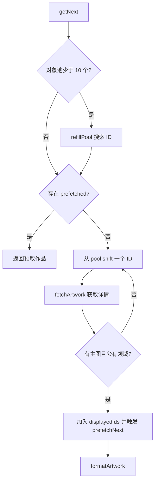
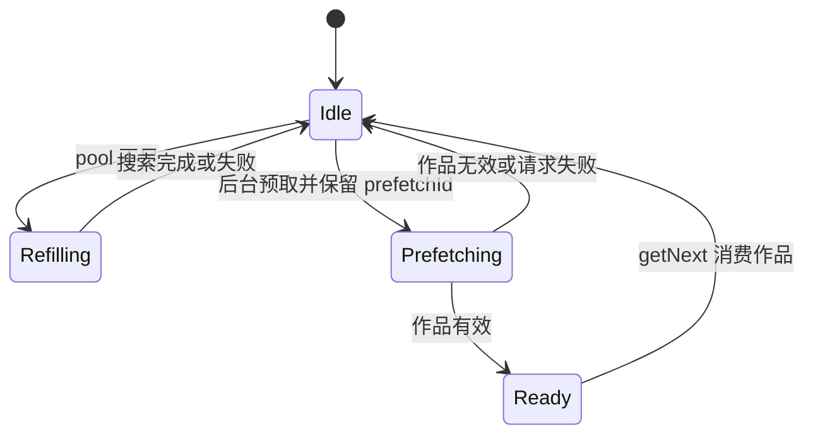

# Met API 缺陷分析

## 当前职责

`src/api/met-api.js` 负责从 Met Museum Collection API 搜索公开图片对象、维护候选对象池、获取作品详情，并通过预取降低下一次展示等待时间。

## 主要风险

1. 预取结果不会从对象池移除。`prefetchNext()` 读取 `pool[0]`，但 `getNext()` 消费 `prefetched` 时没有移除对应 ID，下一轮可能再次预取或展示同一作品。
2. 预取没有进行中状态。多次 `getNext()` 可以并发触发多个 `prefetchNext()`，这些请求可能互相覆盖 `this.prefetched`。
3. `getNext()` 没有串行化共享状态。并发调用会同时补池、移动队列、写入 `displayedIds`，导致重复 ID、额外网络请求和不稳定返回顺序。
4. `refillPool()` 只排除 `displayedIds`，没有排除已经在 `pool` 或预取中的 ID，重复搜索结果会让池内出现重复对象。
5. `fetchJSON()` 没有统一的 settled 防护。超时、响应过大、请求错误和响应结束可能重复触发 resolve/reject；同时用字符串长度限制响应大小不精确。
6. `refillPool()` 假设 `objectIDs` 一定是数组，接口异常或格式变化时会抛出不可读错误。

## 目标结构

## 实现计划

- 增加对象池去重集合，入池时排除已展示、已入池、已预取和正在预取的 ID。
- 让预取有明确的 `prefetchPromise` 和 `prefetchId`，并在预取时从池中取走 ID，避免重复消费。
- 让 `getNext()` 串行执行，所有共享状态更新集中到内部实现。
- 改造 `fetchJSON()`：使用 Buffer 统计字节数，增加一次性 settle，处理响应错误、超时和同步异常。
- 增加小型辅助方法：补池、取 ID、作品有效性判断、记录展示并裁剪历史。

## 测试计划

- 使用 pytest 调用 Node 脚本测试 JS 模块。
- 覆盖预取消费后不重复展示同一 ID。
- 覆盖并发 `getNext()` 不返回重复作品。
- 覆盖补池去重，避免重复 ID 进入对象池。
- 覆盖 `fetchJSON()` 响应过大时只拒绝一次，并释放请求。
